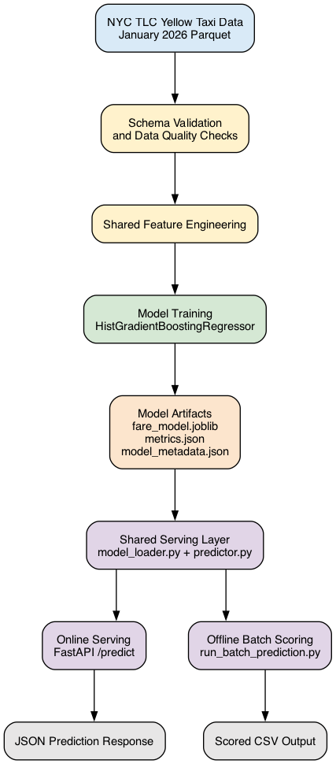

# One Model, Two Serving Paths: Real-Time API and Batch Scoring

This project demonstrates an end-to-end machine learning serving pipeline using the NYC TLC Yellow Taxi dataset.

A single trained regression model is exposed through two inference paths:

- **Real-time inference** using a FastAPI REST API
- **Batch inference** for offline scoring

The solution emphasizes reproducibility, modular design, containerization, automated testing, and deployment readiness.

---

# Architecture



The workflow consists of:

1. Data validation and preprocessing
2. Model training
3. Model serialization
4. Shared prediction layer
5. REST API serving
6. Batch scoring

Both serving paths use the same prediction module to ensure consistent preprocessing and prediction behavior.

---

# Repository Structure

```text
.
├── data/
├── docs/
├── k8s/
├── models/
├── outputs/
├── scripts/
├── src/
├── tests/
├── Dockerfile
├── requirements.txt
└── README.md
```

---

# Setup

## Install dependencies

```bash
pip install -r requirements.txt
```

---

# Train the Model

```bash
python -m src.training.train
```

Training generates:

```text
models/
├── fare_model.joblib
├── metrics.json
└── model_metadata.json
```

---

# Run the API

Start the FastAPI server:

```bash
uvicorn src.api.main:app --host 0.0.0.0 --port 8000
```

Interactive API documentation:

```
http://localhost:8000/docs
```

Available endpoints:

| Endpoint | Description |
|-----------|-------------|
| GET / | Root endpoint |
| GET /health | Liveness probe |
| GET /ready | Readiness probe |
| POST /predict | Predict fare amount |

---

# Batch Scoring

Run batch inference:

```bash
python -m scripts.run_batch_prediction \
    --input yellow_tripdata_2026-01.parquet \
    --output outputs/predictions.csv
```

The batch pipeline validates the dataset, performs preprocessing, generates predictions, and writes the results to a CSV file.

---

# Run Tests

```bash
pytest tests -v
```

Tests cover:

- Data preprocessing
- Prediction pipeline
- REST API
- Prediction parity
- Batch inference

---

# Docker

Build the container:

```bash
docker build -t taxi-fare-api .
```

Run the container:

```bash
docker run -p 8000:8000 taxi-fare-api
```

---

# Kubernetes

The application was validated on a local Minikube Kubernetes cluster.

Deployment assets:

```text
k8s/
├── deployment.yaml
├── service.yaml
└── hpa.yaml
```

Deploy:

```bash
kubectl apply -f k8s/
```

Expose the service locally:

```bash
kubectl port-forward service/taxi-fare-api-service 8000:80
```

Health checks:

```bash
curl http://localhost:8000/health
curl http://localhost:8000/ready
```

The deployment includes:

- Deployment with two replicas
- ClusterIP Service
- Liveness probe
- Readiness probe
- Horizontal Pod Autoscaler (HPA)

---

# Benchmark

The REST API was benchmarked locally using sequential HTTP requests.

| Metric | Value |
|--------|-------:|
| Mean latency | 4.34 ms |
| p50 latency | 4.02 ms |
| p95 latency | 5.54 ms |
| Maximum latency | 45.77 ms |
| Throughput | 230.49 requests/sec |
| Memory (RSS) | ~21 MB |

The measured p95 latency satisfies the assignment target of **less than 150 ms**.

---

# Design Decisions

- A single shared prediction layer is used for both online and batch inference to ensure consistent model behavior.
- Data validation is performed before preprocessing to detect malformed input early.
- Docker provides a reproducible execution environment.
- Kubernetes manifests demonstrate deployment readiness with health checks and autoscaling support.
- Model metrics and metadata are stored alongside the trained model for reproducibility.

---

# Assumptions

- Input data follows the NYC TLC Yellow Taxi schema.
- The trained model is available before serving predictions.
- Prediction requests contain valid pickup timestamps.
- Batch input files conform to the expected schema.

---

# Deployment Readiness

The application is designed for containerized deployment.

Deployment considerations include:

- Dockerized runtime for reproducible execution
- Health (`/health`) and readiness (`/ready`) endpoints
- Kubernetes Deployment, Service, and Horizontal Pod Autoscaler manifests
- Configurable CPU and memory requests/limits
- Stateless API enabling horizontal scaling
- Shared model artifact used by both serving paths

---

# Future Improvements

Possible extensions include:

- MLflow experiment tracking
- Model registry integration
- CI/CD pipeline
- Structured logging
- Prometheus and Grafana monitoring
- Cloud object storage for model artifacts

---

# Conclusion

This project demonstrates an end-to-end machine learning serving workflow, exposing a single trained model through both real-time and batch inference paths. The solution includes automated testing, containerization, benchmarking, and Kubernetes deployment readiness while maintaining a shared inference layer for consistent predictions.